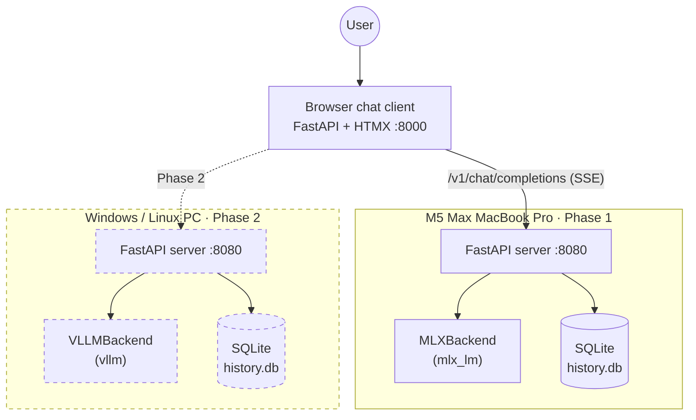
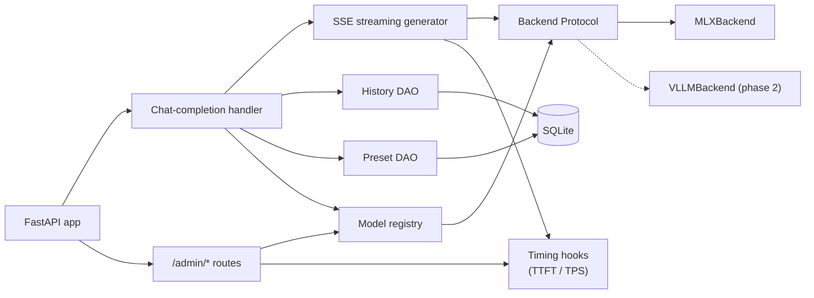
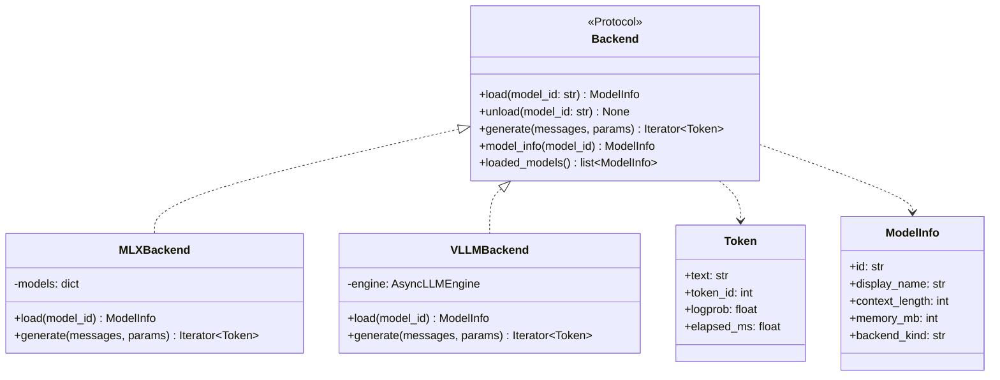
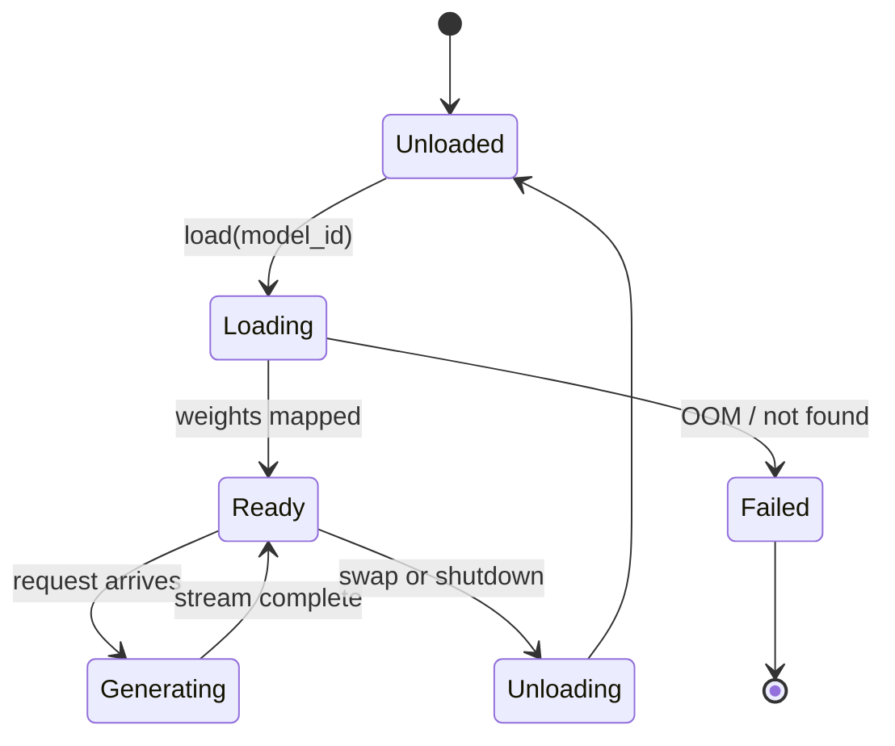
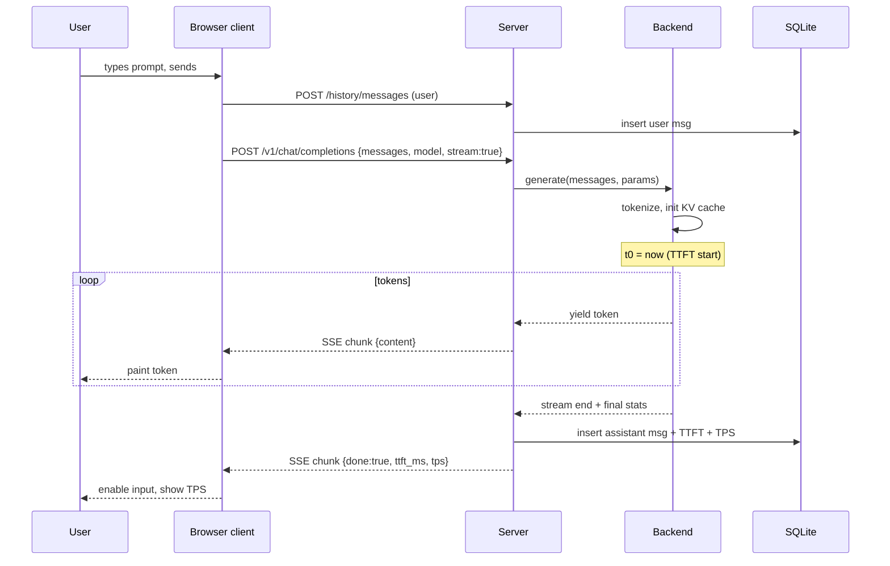
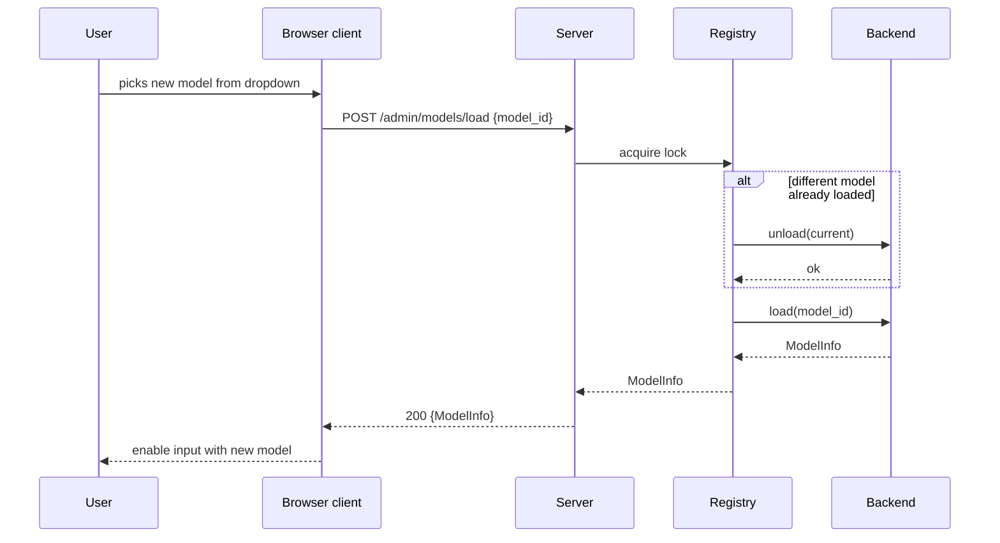
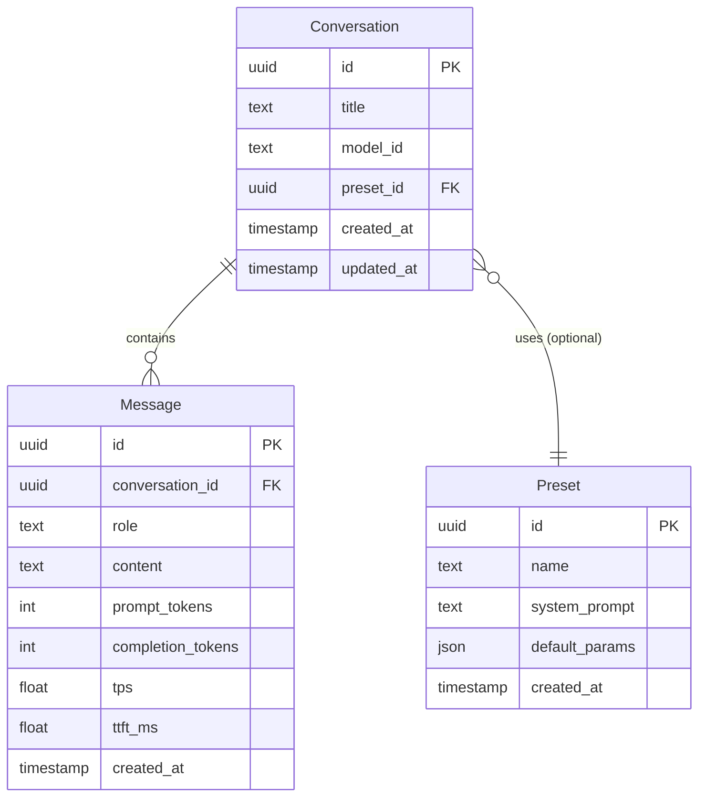
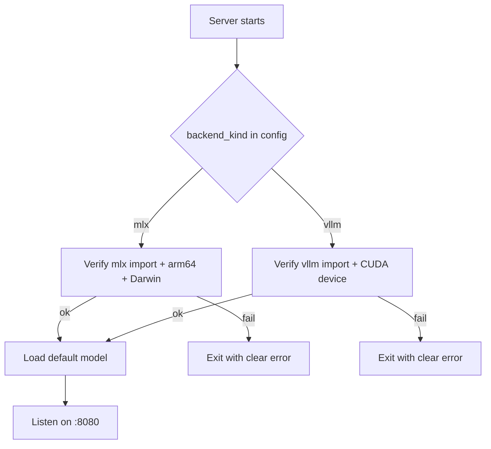

# ARCHITECTURE — local-model

> System design. The *how*. For the *what*, see [`SPEC.md`](./SPEC.md).
>
> Last updated: 2026-04-28.

## 1. System overview (C4 Container)



**Shape.** Each host runs its own server process — same codebase, the `Backend` Protocol implementation chosen at startup by config. The browser client is a *separate* small FastAPI process that knows about one or more inference endpoints. HTTP between client and server is stateless except for explicit `/history/*` and `/presets/*` endpoints; persistence lives on the server side.

## 2. Server internals (C4 Component)



| Component | File (proposed) | Responsibility |
|---|---|---|
| FastAPI app | `src/server/app.py` | Process entry, route table, lifespan hooks (load default model on startup, free on shutdown) |
| Chat-completion handler | `src/server/routes/chat.py` | Validate request (Pydantic), parse sampling params, dispatch to backend, return streaming or non-streaming response |
| SSE streaming generator | `src/server/streaming.py` | Wrap backend token iterator into Server-Sent Events; emit per-token chunks + a trailer with TTFT/TPS |
| Backend Protocol | `src/server/backends/base.py` | The interface; defines `load`, `unload`, `generate`, `model_info`, `loaded_models`. Plus dataclasses `Token`, `ModelInfo` |
| `MLXBackend` | `src/server/backends/mlx_backend.py` | Phase 1 impl, uses `mlx_lm.load` and `mlx_lm.stream_generate` |
| `VLLMBackend` | `src/server/backends/vllm_backend.py` | Phase 2 impl, wraps `vllm.AsyncLLMEngine` |
| Model registry | `src/server/registry.py` | Tracks the currently loaded model; enforces "one model at a time" in v1 |
| History DAO | `src/server/store/history.py` | Plain `sqlite3` wrapper for `Conversation` + `Message` tables |
| Preset DAO | `src/server/store/presets.py` | Plain `sqlite3` wrapper for `Preset` table |
| DB connection | `src/server/store/db.py` | Single connection, schema migrations on startup |
| Timing hooks | `src/server/timing.py` | Instruments TTFT and TPS around each `generate()` call; exposes via `/admin/stats` and SSE trailers |
| Config | `src/server/config.py` | Pydantic Settings — env vars + defaults |

## 3. Backend abstraction



`Backend` is a `typing.Protocol`, not an `abc.ABC`. Rationale, alternatives, and consequences are captured in [ADR 0003](./docs/decisions/0003-server-architecture.md). In short: lighter, doesn't force inheritance, plays well with structural typing, and lets us write a fake `Backend` for tests in ~20 lines.

## 4. Model lifecycle



v1 holds **one model at a time**. A swap is `unload(current) → load(new)`, serialized via the model registry's lock. Parallel multi-model serving is explicitly deferred (see [SPEC §6](./SPEC.md#6-non-goals-v1)).

## 5. Data flow — canonical chat request



## 6. Data flow — model swap



## 7. Storage model



- Single SQLite file at `data/history.db` (gitignored)
- Stdlib `sqlite3` only — no ORM (avoids cognitive overhead, keeps focus on inference)
- Schema migrations on server startup (idempotent `CREATE TABLE IF NOT EXISTS`)
- Foreign keys enforced via `PRAGMA foreign_keys = ON`
- UUIDs stored as `TEXT` (sqlite has no native UUID); generated in Python with `uuid4()`

## 8. API surface

See [`SPEC §9.1`](./SPEC.md#91-server-openai-compatible--project-specific) for the full route table. Implementation notes:

- **OpenAI-compatible routes** match the [OpenAI Chat Completions spec](https://platform.openai.com/docs/api-reference/chat) closely enough that any OpenAI client (Python `openai`, JS `openai`, `curl` examples) works against us by setting `base_url=http://localhost:8080/v1`
- **Project-specific routes** under `/admin`, `/history`, `/presets` use plain JSON, not the OpenAI shape
- All routes return Pydantic-validated responses; errors use FastAPI's standard `HTTPException` with structured detail

## 9. Streaming protocol

The server uses **Server-Sent Events** (SSE) over chunked HTTP for `POST /v1/chat/completions` when `stream=true`. Event shape matches OpenAI's:

```
data: {"id":"...", "choices":[{"delta":{"content":"Hello"}, "index":0}]}

data: {"id":"...", "choices":[{"delta":{"content":" world"}, "index":0}]}

data: {"id":"...", "choices":[{"delta":{}, "finish_reason":"stop", "index":0}], "x_local_model_stats":{"ttft_ms":42.0, "tps":58.7}}

data: [DONE]
```

The `x_local_model_stats` trailer is a **non-standard extension** — OpenAI clients ignore unknown fields, so this is safe. Our own client reads it to update the live TPS / TTFT display.

## 10. Capability detection (startup)



No fallback. The error message names the missing requirement (e.g. *"MLX backend unavailable: requires Apple Silicon (got x86_64) and `mlx_lm` (not importable)"*).

## 11. Configuration

Pydantic `Settings` reads from env + `.env`:

| Setting | Default | Notes |
|---|---|---|
| `LOCAL_MODEL_BACKEND` | `mlx` | `mlx` \| `vllm` |
| `LOCAL_MODEL_DEFAULT_MODEL` | `mlx-community/Llama-3.1-8B-Instruct-4bit` | Loaded at startup; can swap later |
| `LOCAL_MODEL_HOST` | `127.0.0.1` | Bind address |
| `LOCAL_MODEL_PORT` | `8080` | Server port |
| `LOCAL_MODEL_DB_PATH` | `data/history.db` | SQLite location |
| `LOCAL_MODEL_LOG_LEVEL` | `INFO` | Standard Python logging level |
| `LOCAL_MODEL_MODELS_DIR` | `models/` | Optional override of HF cache location |

Client has its own settings for the endpoint list:

| Setting | Default | Notes |
|---|---|---|
| `LOCAL_MODEL_CLIENT_ENDPOINTS` | `[{"name":"local","url":"http://127.0.0.1:8080"}]` | JSON list; user adds the PC in Phase 2 |
| `LOCAL_MODEL_CLIENT_PORT` | `8000` | Client UI port |

## 12. Repo layout

```
local-model/
├── src/
│   ├── server/
│   │   ├── app.py
│   │   ├── config.py
│   │   ├── streaming.py
│   │   ├── registry.py
│   │   ├── timing.py
│   │   ├── routes/
│   │   │   ├── chat.py
│   │   │   ├── models.py
│   │   │   ├── admin.py
│   │   │   ├── history.py
│   │   │   └── presets.py
│   │   ├── backends/
│   │   │   ├── base.py            # Protocol + Token + ModelInfo
│   │   │   ├── mlx_backend.py     # Phase 1
│   │   │   └── vllm_backend.py    # Phase 2 stub
│   │   └── store/
│   │       ├── db.py
│   │       ├── history.py
│   │       └── presets.py
│   └── client/
│       ├── app.py                 # FastAPI + HTMX UI
│       ├── templates/             # Jinja2
│       └── static/
├── bench/
│   ├── throughput.py
│   ├── vibe_check.py
│   ├── eval_harness.py
│   ├── prompts/
│   │   └── vibe_check.json
│   └── results/                   # gitignored
├── tests/
│   ├── server/
│   ├── client/
│   └── bench/
├── docs/
│   ├── decisions/                 # ADRs
│   └── diagrams.md
├── models/                        # gitignored — model weights cache
├── data/                          # gitignored — SQLite db
├── SPEC.md
├── ARCHITECTURE.md
├── README.md
├── CLAUDE.md
└── pyproject.toml
```

## 13. Testing strategy

| Layer | Tool | What's tested |
|---|---|---|
| **Unit** | `pytest` | DAOs (against an in-memory SQLite), config parsing, streaming wrapper, timing hooks. Backends tested via a fake `Backend` impl that yields canned tokens — no real model loaded |
| **Integration** | `pytest` + `httpx.AsyncClient` | The FastAPI app end-to-end against the fake backend: route validation, SSE shape, history persistence, admin endpoints |
| **Smoke** | `pytest -m mac_only` | Phase 1 only: spin up the real `MLXBackend` with a tiny model (e.g. `mlx-community/SmolLM-135M-Instruct-4bit`), verify a single chat completion. Marked so it's skipped on machines without MLX |
| **Benchmarks** | `bench/*.py` (not pytest) | Performance + quality. Outputs reports under `bench/results/`. Not run as part of the test suite |

## 14. Cross-cutting concerns

### Logging

Standard library `logging`; configured in `app.py`. JSON formatter optional via env. Per-request correlation ID injected as a context var so async tasks log with the same ID.

### Error handling

- Client errors (bad request, model not loaded, etc.) → `HTTPException` with structured `detail`
- Backend errors during streaming → emit a final SSE event with `finish_reason: "error"` and a `error` field; the client surfaces it inline
- Hard failures during startup (capability check) → log + `sys.exit(1)`. Do not silently fall back

### Concurrency

FastAPI is async-native. Backend `generate()` is a sync iterator; we run it in a worker thread (`anyio.to_thread.run_sync`) so the event loop stays responsive for other clients. With one user there is no realistic contention.

## 15. Deployment topology

### Phase 1 (Mac, single user)

Two terminal windows (or `tmux` panes). Both bound to `127.0.0.1`.

```
Terminal A:  uv run python -m server.app          # :8080, MLX
Terminal B:  uv run python -m client.app          # :8000, browser UI
```

User opens `http://127.0.0.1:8000` in a browser.

### Phase 2 (PC added)

PC runs the same server, with `LOCAL_MODEL_BACKEND=vllm`. Client config is updated to list both endpoints; the user picks per session. Both servers continue to bind `127.0.0.1` — the client app is the only thing that crosses machines (the user opens its UI from whichever machine they're sitting at).
