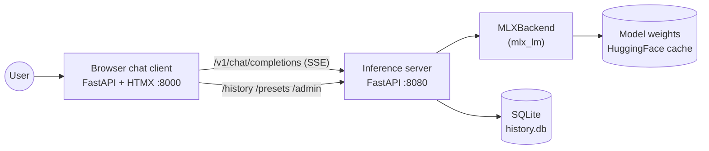

# local-model

Local LLM deployment on Apple Silicon using [MLX](https://github.com/ml-explore/mlx), with a from-scratch FastAPI inference server and a small browser chat client. Cross-platform follow-on (RTX 4080 + vLLM) lands in Phase 2.

A learning project: the point is to wire up the inference layer ourselves, not to wrap LM Studio or Ollama.

## Status

Spec and architecture drafted. Code scaffolding is the next step.

- [`SPEC.md`](./SPEC.md) — what we're building, scope, success criteria
- [`ARCHITECTURE.md`](./ARCHITECTURE.md) — how it's built, components, interfaces
- [`docs/decisions/`](./docs/decisions/) — ADRs for non-obvious choices
- [`docs/diagrams.md`](./docs/diagrams.md) — diagram index

## At-a-glance (Phase 1)



The server is OpenAI-compatible: any OpenAI client works against `http://127.0.0.1:8080/v1`. The client is a small FastAPI + HTMX app that uses the same API plus a few project-specific endpoints for history, presets, and admin.

## Phasing

| Phase | What ships |
|---|---|
| **1** (= v1) | Mac M5 Max, MLX inference server, browser chat client, streaming, history, presets, hot model swap, TPS / TTFT display, benchmarks |
| **2** | RTX 4080 PC running the same codebase with a `VLLMBackend`; client gains multi-endpoint config; cross-backend benchmarks |
| **Later** | Vision / attachments, tool calling, fine-tuning |

## Setup

Requires Python 3.12+ and [`uv`](https://github.com/astral-sh/uv) on macOS Apple Silicon.

```bash
git clone https://github.com/kashman001/local-model.git
cd local-model
uv sync --extra dev
```

All runtime deps including `python-multipart` (required by FastAPI form handling) are pulled by the default install — no extras needed for the chat client.

For benchmarks (optional, larger install):

```bash
uv sync --extra dev --extra bench
```

## Run

In two terminals (or `tmux` panes):

```bash
# Terminal A — inference server on :8080
uv run uvicorn server.app:build_app_from_env --factory --port 8080

# Terminal B — browser chat client on :8000
uv run uvicorn client.app:build_app_from_env --factory --port 8000
```

Open <http://127.0.0.1:8000> in a browser. The first request will download the default model (`mlx-community/Llama-3.1-8B-Instruct-4bit`, ~5 GB) into the HuggingFace cache.

## Test

```bash
uv run pytest -q                # everything that doesn't need a real model
uv run pytest -q -m mac_only    # the MLX smoke tests, on Apple Silicon
```

## Benchmark

```bash
# Engine-level throughput (TTFT, TPS) — JSON report under bench/results/
uv run python -m bench.throughput \
    --model mlx-community/Llama-3.1-8B-Instruct-4bit --runs 3

# Curated 30-prompt vibe check — Markdown report under bench/results/
uv run python -m bench.vibe_check \
    --model mlx-community/Llama-3.1-8B-Instruct-4bit

# lm-evaluation-harness (requires `--extra bench`)
uv run python -m bench.eval_harness \
    --model mlx-community/Llama-3.1-8B-Instruct-4bit --task mmlu_stem
```

## Documentation

- [`SPEC.md`](./SPEC.md) — functional spec
- [`ARCHITECTURE.md`](./ARCHITECTURE.md) — system design
- [`CLAUDE.md`](./CLAUDE.md) — context for Claude Code sessions working on this repo
- [`docs/decisions/`](./docs/decisions/) — ADRs
- [`docs/diagrams.md`](./docs/diagrams.md) — every diagram in the repo, indexed

## License

[MIT](./LICENSE).
