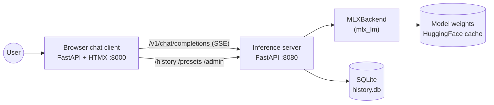

# local-model

Local LLM deployment on Apple Silicon using [MLX](https://github.com/ml-explore/mlx), with a from-scratch FastAPI inference server and a small browser chat client. Cross-platform follow-on (RTX 4080 + vLLM) lands in Phase 2.

A learning project: the point is to wire up the inference layer ourselves, not to wrap LM Studio or Ollama.

## Status

Spec and architecture drafted. Code scaffolding is the next step.

- [`SPEC.md`](./SPEC.md) — what we're building, scope, success criteria
- [`ARCHITECTURE.md`](./ARCHITECTURE.md) — how it's built, components, interfaces
- [`docs/decisions/`](./docs/decisions/) — ADRs for non-obvious choices
- [`docs/diagrams.md`](./docs/diagrams.md) — diagram index

## At-a-glance (Phase 1)

The server is OpenAI-compatible: any OpenAI client works against `http://127.0.0.1:8080/v1`. The client is a small FastAPI + HTMX app that uses the same API plus a few project-specific endpoints for history, presets, and admin.

## Phasing

| Phase | What ships |
|---|---|
| **1** (= v1) | Mac M5 Max, MLX inference server, browser chat client, streaming, history, presets, hot model swap, TPS / TTFT display, benchmarks |
| **2** | RTX 4080 PC running the same codebase with a `VLLMBackend`; client gains multi-endpoint config; cross-backend benchmarks |
| **Later** | Vision / attachments, tool calling, fine-tuning |

## Setup

_Will be populated once the first server PR scaffolds `pyproject.toml`. Tooling per [ADR 0001](./docs/decisions/0001-python-tooling.md): `uv` + `ruff` + `pytest`._

## Documentation

- [`SPEC.md`](./SPEC.md) — functional spec
- [`ARCHITECTURE.md`](./ARCHITECTURE.md) — system design
- [`CLAUDE.md`](./CLAUDE.md) — context for Claude Code sessions working on this repo
- [`docs/decisions/`](./docs/decisions/) — ADRs
- [`docs/diagrams.md`](./docs/diagrams.md) — every diagram in the repo, indexed

## License

[MIT](./LICENSE).
