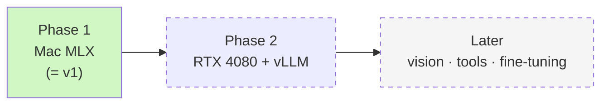
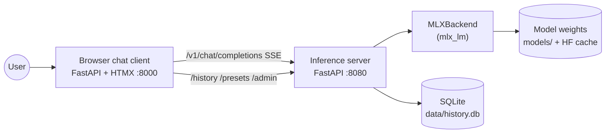
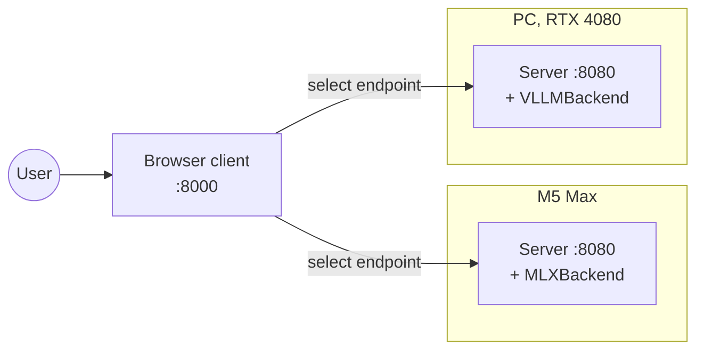

# SPEC — local-model

> Functional spec. The *what* and *why*. For the *how*, see [`ARCHITECTURE.md`](./ARCHITECTURE.md).
>
> Last updated: 2026-04-28.

## 1. Purpose

`local-model` is a **learning-driven** local LLM stack. The project owner deploys open-weights LLMs on their own hardware, writes the inference server directly against [MLX](https://github.com/ml-explore/mlx) (no LM Studio / Ollama wrappers), and chats with deployed models through a browser client they also wrote.

The deliverable is twofold:

1. **Hands-on exposure** to the inference layer — tokenization, generation loops, KV cache, streaming, sampling.
2. **A working chat experience** the owner uses day-to-day on real hardware, with measurable performance.

## 2. Audience

Single user: the project owner. No multi-tenant or public-facing concerns.

## 3. Hardware in scope

| Machine | Role | Backend in this project |
|---|---|---|
| **M5 Max MacBook Pro, 128 GB unified memory** | Primary dev + inference (Phase 1) | `MLXBackend` (uses `mlx_lm`) |
| **PC, NVIDIA RTX 4080 (16 GB VRAM)** | Secondary inference (Phase 2) | `VLLMBackend` (uses `vllm`) |

128 GB unified memory means model size is **not** a constraint on the Mac side — anything from 3B to 70B at 4-bit is in play; even Mixtral-8x22B fits. The project's design treats hardware as a runtime input rather than a build-time assumption: the server detects what it is on and wires up the appropriate backend at startup.

## 4. Goals (Phase 1, the v1 deliverable)

1. Deploy any MLX-compatible model on the M5 Max via a custom FastAPI server the owner wrote
2. Chat with the deployed model in a browser, **streaming token-by-token**
3. **Hot-swap** models without restarting the server (one model loaded at a time)
4. **Persist** conversation history across restarts; switch between past conversations
5. Save and reuse **system-prompt presets**
6. Display **tokens-per-second** and **time-to-first-token** live in the UI
7. Run **benchmarks** at three layers: engine micro-bench, quality eval (`lm-evaluation-harness`), curated vibe-check prompt set

## 5. Goals (Phase 2)

8. Same client, same server codebase, talking to a `VLLMBackend` running on the RTX 4080 PC
9. Cross-backend benchmark comparison (same prompts → side-by-side results from MLX-on-Mac vs vLLM-on-PC)

## 6. Non-goals (v1)

Explicitly out of scope, with intent — agents should not propose adding these without an explicit SPEC update:

- Multi-tenant serving, authentication, public-network exposure
- Vision / multimodal input
- Tool calling / function calling
- Embeddings (`/v1/embeddings`) or legacy completions (`/v1/completions`)
- Concurrent multi-model serving in one process (swap is supported; parallel is not)
- Fine-tuning workflows
- Production polish, packaging for redistribution
- Pre-commit hooks / CI (per [ADR 0002](./docs/decisions/0002-deferred-tooling.md))

Some of these (vision, tools, embeddings) are *deferred* — likely to land in a future phase. Others (multi-tenant, auth, public exposure) are out-of-scope for the project entirely.

## 7. Phasing

### Phase 1 — Mac MLX

System context for the v1 deliverable:

**Phase 1 is done when** every item in §11 (Success criteria) is true.

### Phase 2 — RTX 4080 + vLLM

The client gains a config list of endpoints; the user picks which to talk to per session.

## 8. Capability detection

On startup the server verifies its expected runtime:

- For `MLXBackend`: `import mlx` succeeds, `platform.machine() == "arm64"`, `platform.system() == "Darwin"`
- For `VLLMBackend` (Phase 2): `import vllm` succeeds, CUDA device visible

If checks fail, the server **exits with a clear error** naming the missing requirement. There is **no fallback backend** on either host in v1 — Mac runs MLX or it doesn't run at all. This is by design: MLX is the *point* on Mac.

## 9. Functional surface

### 9.1 Server (OpenAI-compatible + project-specific)

| Endpoint | Method | Purpose |
|---|---|---|
| `/v1/models` | GET | List loaded + available models |
| `/v1/chat/completions` | POST | Streaming + non-streaming chat |
| `/admin/models/load` | POST | `{model_id}` — load a model into memory |
| `/admin/models/unload` | POST | `{model_id}` — free a model |
| `/admin/stats` | GET | Live TPS, peak memory, currently loaded model(s) |
| `/history/conversations` | GET, POST | List / create conversations |
| `/history/conversations/{id}` | GET, DELETE | Fetch / delete |
| `/history/messages` | POST | Append a message (used by client to log the user prompt before completion) |
| `/presets` | GET, POST | List / create system-prompt presets |
| `/presets/{id}` | DELETE | Remove |

`/v1/embeddings` and `/v1/completions` are **deferred**.

### 9.2 Client (browser)

A small FastAPI + Jinja2 + HTMX app served on `:8000`. Pages:

- **Chat** — input box, streaming response area, model picker, preset picker, live TPS / TTFT readout
- **History** — list of past conversations, click to resume
- **Presets** — manage saved system prompts
- **Stats** — current server stats (mirror of `/admin/stats`)

No JS framework. HTMX handles SSE streaming and partial swaps; Jinja2 renders pages.

## 10. Benchmarks (in-scope for v1)

| Layer | Tool | Output |
|---|---|---|
| **Engine micro-bench** | `bench/throughput.py` (custom; hits `/v1/chat/completions`) and `mlx_lm.generate --verbose` for raw library numbers | TTFT, sustained TPS, peak RSS, JSON report |
| **Quality eval** | `bench/eval_harness.py` driving [`lm-evaluation-harness`](https://github.com/EleutherAI/lm-evaluation-harness) against the OpenAI-compatible endpoint — MMLU (5-shot, stem subset), GSM8K, HumanEval | Per-task pass rates, JSON report |
| **Vibe check** | `bench/vibe_check.py` runs ~30 curated prompts across reasoning, code, summarization, instruction-following | Markdown per-model report for human review |

`bench/` is a first-class directory. `lm-evaluation-harness` lives in an `[bench]` extras group so day-to-day `uv sync` stays light.

## 11. Success criteria for v1

Phase 1 ships when **all** of the following are true:

1. ✅ The user can chat with at least one MLX model end-to-end through the browser, with tokens streaming visibly
2. ✅ TTFT and sustained TPS are visible in the UI during/after generation
3. ✅ Conversation history persists across server restarts; the user can resume any past conversation
4. ✅ The user can swap to a different MLX model from the UI without restarting the server
5. ✅ At least one system-prompt preset can be created, applied, and reused
6. ✅ `bench/throughput.py --model <id>` produces a JSON report
7. ✅ `bench/eval_harness.py --task mmlu_stem` runs against the local server and produces scores
8. ✅ `bench/vibe_check.py --model <id>` produces a per-model Markdown report
9. ✅ `SPEC.md`, `ARCHITECTURE.md`, `README.md` all carry Mermaid diagrams; an agent reading them in isolation can build the same mental picture

## 12. Constraints inherited from project decisions

- Python toolchain: `uv` + `ruff` + `pytest` ([ADR 0001](./docs/decisions/0001-python-tooling.md))
- No pre-commit hooks, no CI in v1 ([ADR 0002](./docs/decisions/0002-deferred-tooling.md))
- Server architecture: custom FastAPI server with a `Backend` Protocol; not a wrapper over `mlx_lm.server` ([ADR 0003](./docs/decisions/0003-server-architecture.md))
- All diagrams in markdown via Mermaid (see [`docs/diagrams.md`](./docs/diagrams.md))

## 13. Open questions resolved during design

These were discussed and settled during the 2026-04-28 design session; logged here so future sessions can see the *why* without re-litigating:

| Question | Resolution |
|---|---|
| Use Ollama / LM Studio as the inference layer? | **No.** Defeats the learning goal; Ollama uses llama.cpp (not MLX) for chat. |
| Use `mlx_lm.server` directly (no custom server)? | **No.** Same reason — we want to write the inference loop. |
| Build cross-platform from v1 with abstracted backends? | **No, but interface-ready.** Custom server with a `Backend` Protocol from day 1; only `MLXBackend` implemented in v1. |
| Phase 2 PC backend choice? | **vLLM** (production-grade serving, exposes a different paradigm than MLX). Confirmed in [ADR 0003](./docs/decisions/0003-server-architecture.md). |
| Frontend stack? | **FastAPI + Jinja2 + HTMX** — single language, no JS toolchain, keeps focus on the inference layer. |
| Multi-model concurrency? | **No.** One model at a time; swap supported, parallel not. |
| Soft fallback on Mac if MLX unavailable? | **No.** Hard error at startup; no fallback path in v1. |
| Image/vision attachments in v1? | **Deferred.** Significant scope addition; not core to the learning loop. |

## 14. Glossary

- **TTFT** — time-to-first-token. Wall-clock between request arrival and the first token streaming back. UX-critical.
- **TPS** — tokens-per-second, sustained. Throughput measure once generation is underway.
- **Backend** — a `Protocol` in `src/server/backends/base.py`. v1 has one impl (`MLXBackend`); v2 adds `VLLMBackend`.
- **Vibe check** — informal, curated prompt set for human-eyeball quality assessment. Complements quantitative evals.
