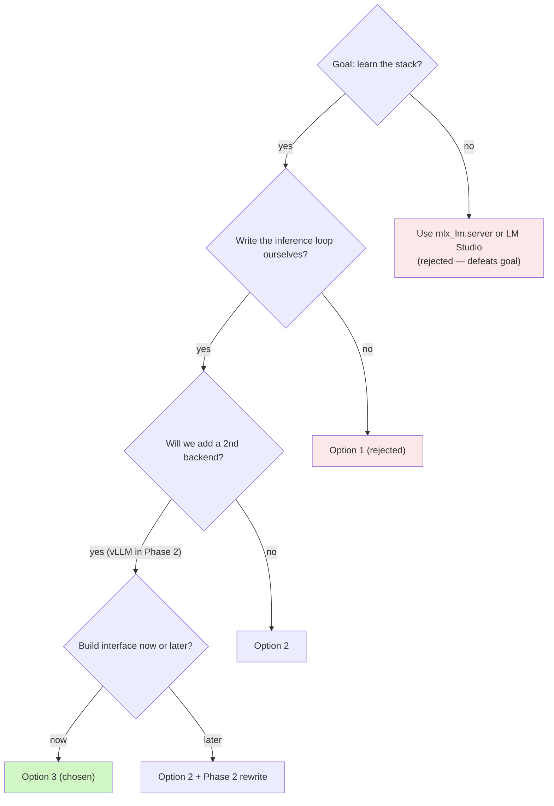

# 0003 — Server architecture: custom FastAPI server with `Backend` Protocol

- **Status:** Accepted
- **Date:** 2026-04-28
- **Deciders:** project owner

## Context

The original `CLAUDE.md` plan named `mlx-lm.server` as the default inference layer. During SPEC drafting (2026-04-28) we revisited that against the project's stated goal: *learning the local-inference stack hands-on, with real inference on both the M5 Max Mac and the RTX 4080 PC.*

Three alternatives were on the table:

1. **Use `mlx_lm.server` unmodified** — Apple ships an OpenAI-compatible server. Zero server code to write
2. **Custom FastAPI server using the `mlx_lm` Python API directly** — we write the chat-completions handler, streaming loop, and tokenizer wiring against `mlx_lm.load` / `mlx_lm.stream_generate`
3. **Custom server with a backend interface from day 1** — option 2 plus a `Backend` Protocol so a future `VLLMBackend` (RTX 4080, Phase 2) plugs in without rewrites
4. **Skip a custom server entirely; run native servers on each host** — `mlx_lm.server` on Mac, `vllm serve` on PC; client knows multiple endpoints

## Decision

**Option 3.** Custom FastAPI server, with a `Backend` Protocol from day 1; v1 ships with one implementation (`MLXBackend`); a `VLLMBackend` is added in Phase 2.

Concretely:

- `src/server/backends/base.py` defines `Backend` as a `typing.Protocol`, plus `Token` and `ModelInfo` dataclasses
- `src/server/backends/mlx_backend.py` is the only implementation in v1, wrapping `mlx_lm.load` and `mlx_lm.stream_generate`
- `src/server/backends/vllm_backend.py` ships as a stub in v1 — present so the directory layout is stable, raising `NotImplementedError` until Phase 2
- The chosen backend is selected at startup via `LOCAL_MODEL_BACKEND` env var; capability detection rejects misconfiguration with a clear error rather than silently falling back

## Reasoning

The deciding factor is the **learning goal** ([SPEC §1](../../SPEC.md#1-purpose)):

- **Option 1** (use `mlx_lm.server`) writes no inference code. The user learns how to deploy someone else's server, not how inference is wired. Defeats the goal.
- **Option 4** (native servers per host) writes no inference code *and* adds operational complexity (which endpoint is live? which model is loaded where?). Worst of both worlds for this project.
- **Option 2** (custom server, no backend interface) writes the inference loop directly — good — but commits to a Phase 2 rewrite when adding vLLM.
- **Option 3** writes the inference loop *and* defines a small interface. The "premature abstraction" objection is weak here because the OpenAI chat-completions shape is industry-standard: `(messages, params) -> Iterator[Token]` is well-defined regardless of backend. With only ~2 known backends in scope, the protocol is hard to get badly wrong, and the v2 rework cost is meaningfully higher than the v1 abstraction cost.

A `Protocol` rather than an `abc.ABC` because:

- Lighter — no inheritance forced on backend classes
- Structural typing plays well with our test strategy: a fake backend that yields canned tokens is ~20 lines and doesn't subclass anything
- We're not policing against runtime mistyping aggressively; static checks (ruff + occasional `mypy --strict` if we add it) catch shape errors

## Decision flowchart

## Alternatives considered

### Option 1 — `mlx_lm.server` unmodified

**Pros:** zero server code, fastest path to a running endpoint, official upstream support.
**Cons:** opaque inference layer; we'd never write tokenization, streaming, or sampling code; locks us into upstream's feature set.
**Why rejected:** misaligned with the learning goal.

### Option 2 — Custom server, no `Backend` Protocol

**Pros:** simpler than Option 3; less Python plumbing in v1; same hands-on inference exposure.
**Cons:** Phase 2 requires either rewriting the chat-completion handler around vLLM or running a second, parallel server codebase.
**Why rejected:** the `Backend` Protocol is small (~50 lines) and the rewrite-vs-add-impl tradeoff favors building the interface upfront.

### Option 4 — Native servers on each host, no custom server

**Pros:** zero server code total.
**Cons:** opaque inference on both hosts; client must orchestrate multiple endpoints with different feature sets; learning value approximates zero on the server side.
**Why rejected:** doesn't address the goal at all.

## Consequences

**Positive**

- The `Backend` Protocol crystallizes what the server actually depends on from the inference layer. That makes it easy to write a fake backend for tests, easy to reason about Phase 2 effort, and easy to reject feature creep that doesn't fit the interface
- Adding `VLLMBackend` in Phase 2 is a localized change: implement the Protocol, register it. No route changes, no client changes
- The user writes the streaming loop, the OpenAI protocol shape, and the tokenizer wiring — direct exposure to MLX's API in v1

**Negative / risks**

- Slightly more v1 code than Option 2 (~50 extra lines for the Protocol + dispatch). Mitigated: the cost is small and the Phase 2 dividend is real
- Risk of designing the Protocol around MLX assumptions and discovering they don't fit vLLM cleanly. Mitigated: the OpenAI chat-completions shape is well-understood; both backends already serve it natively elsewhere, so the in/out shape is constrained by an industry contract, not by our guess

## Revisit when

Re-evaluate this decision when **any** of:

- A third backend is contemplated (e.g. llama.cpp on Mac for comparison) — at that point, look at whether the Protocol is still the right abstraction or whether it's grown awkward
- Phase 2 reveals that vLLM's async-native API doesn't fit the sync iterator we used for MLX — may need to broaden `Backend.generate` to return `AsyncIterator[Token]`
- The project gains a second user, at which point multi-tenant concerns may want a different layer

## Follow-ups

- Define `Backend`, `Token`, `ModelInfo` in `src/server/backends/base.py` as the first server PR
- Implement `MLXBackend` in `src/server/backends/mlx_backend.py`
- Stub `VLLMBackend` in `src/server/backends/vllm_backend.py` (raises `NotImplementedError`) to keep the directory layout stable
- Capture the Protocol shape in [`ARCHITECTURE.md §3`](../../ARCHITECTURE.md#3-backend-abstraction)
